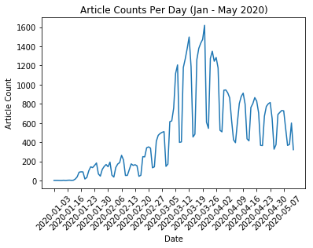

# Analyzing COVID-19 Media Coverage

During times of public fear, communications are instrumental in preventing adverse consequences. COVID-19 media coverage has varied worldwide, with some outlets expressing skepticism and others advising caution. This project will be utilizing exploratory data analysis and text visualizations to understand how the media coverage varied over time and by outlet. 

## Importing the Data 

We will be using a dataset from **Kaggle** which contains articles about COVID-19 since January 2020. The dataset was produced by **Anacode**, a Berlin-based company, and might be more global & Euro-centric compared to mainstream news in the USA.


```python
import pandas as pd
import numpy as np

```


```python
from kaggle.api.kaggle_api_extended import KaggleApi

api = KaggleApi()
api.authenticate()
api.dataset_download_files('jannalipenkova/covid19-public-media-dataset')

```

    Warning: Your Kaggle API key is readable by other users on this system! To fix this, you can run 'chmod 600 /Users/deepikadilip/.kaggle/kaggle.json'


```python
df = pd.read_csv('covid19-public-media-dataset/covid19_articles_20200512.csv')
df = df.drop(columns = ['Unnamed: 0'])
df.head()
```


<div>
<style scoped>
    .dataframe tbody tr th:only-of-type {
        vertical-align: middle;
    }

    .dataframe tbody tr th {
        vertical-align: top;
    }

    .dataframe thead th {
        text-align: right;
    }
</style>
<table border="1" class="dataframe">
  <thead>
    <tr style="text-align: right;">
      <th></th>
      <th>title</th>
      <th>author</th>
      <th>date</th>
      <th>domain</th>
      <th>url</th>
      <th>content</th>
      <th>topic_area</th>
    </tr>
  </thead>
  <tbody>
    <tr>
      <th>0</th>
      <td>My experience of surviving cancer twice</td>
      <td>Helen Ziatyk</td>
      <td>2020-01-03</td>
      <td>medicalnewstoday</td>
      <td>https://www.medicalnewstoday.com/articles/327373</td>
      <td>“Helen, I’m so sorry to tell you that you have...</td>
      <td>healthcare</td>
    </tr>
    <tr>
      <th>1</th>
      <td>Ginger: Health benefits and dietary tips</td>
      <td>Jenna Fletcher</td>
      <td>2020-01-03</td>
      <td>medicalnewstoday</td>
      <td>https://www.medicalnewstoday.com/articles/2659...</td>
      <td>If you buy something through a link on this pa...</td>
      <td>healthcare</td>
    </tr>
    <tr>
      <th>2</th>
      <td>China pneumonia outbreak may be caused by Sars...</td>
      <td>Reuters</td>
      <td>2020-01-08</td>
      <td>theguardian</td>
      <td>https://www.theguardian.com/science/2020/jan/0...</td>
      <td>A cluster of more than 50 pneumonia cases in t...</td>
      <td>general</td>
    </tr>
    <tr>
      <th>3</th>
      <td>New virus identified as likely cause of myster...</td>
      <td>nature</td>
      <td>2020-01-08</td>
      <td>nature</td>
      <td>https://www.nature.com/articles/d41586-020-000...</td>
      <td>Passengers arriving at Hong Kong's internation...</td>
      <td>science</td>
    </tr>
    <tr>
      <th>4</th>
      <td>China's Sars-like illness worries health exper...</td>
      <td>https://www.theguardian.com/profile/sarahboseley</td>
      <td>2020-01-09</td>
      <td>theguardian</td>
      <td>https://www.theguardian.com/world/2020/jan/09/...</td>
      <td>The finding that the outbreak of viral pneumon...</td>
      <td>general</td>
    </tr>
  </tbody>
</table>
</div>


```python
df.info()
```

    <class 'pandas.core.frame.DataFrame'>
    RangeIndex: 60896 entries, 0 to 60895
    Data columns (total 7 columns):
    title         60896 non-null object
    author        49494 non-null object
    date          60896 non-null object
    domain        60896 non-null object
    url           60896 non-null object
    content       60896 non-null object
    topic_area    60896 non-null object
    dtypes: object(7)
    memory usage: 3.3+ MB


## Data Manipulation

While the data is quite tidy (thanks Internet!), we'll need to convert the variables to forms that will be useful. 


```python
# Converting Date into multiple components

df[['year','month', 'day']] = df.date.str.split("-",expand=True) 

```


```python
df.head()
```


<div>
<style scoped>
    .dataframe tbody tr th:only-of-type {
        vertical-align: middle;
    }

    .dataframe tbody tr th {
        vertical-align: top;
    }

    .dataframe thead th {
        text-align: right;
    }
</style>
<table border="1" class="dataframe">
  <thead>
    <tr style="text-align: right;">
      <th></th>
      <th>title</th>
      <th>author</th>
      <th>date</th>
      <th>domain</th>
      <th>url</th>
      <th>content</th>
      <th>topic_area</th>
      <th>year</th>
      <th>month</th>
      <th>day</th>
    </tr>
  </thead>
  <tbody>
    <tr>
      <th>0</th>
      <td>My experience of surviving cancer twice</td>
      <td>Helen Ziatyk</td>
      <td>2020-01-03</td>
      <td>medicalnewstoday</td>
      <td>https://www.medicalnewstoday.com/articles/327373</td>
      <td>“Helen, I’m so sorry to tell you that you have...</td>
      <td>healthcare</td>
      <td>2020</td>
      <td>01</td>
      <td>03</td>
    </tr>
    <tr>
      <th>1</th>
      <td>Ginger: Health benefits and dietary tips</td>
      <td>Jenna Fletcher</td>
      <td>2020-01-03</td>
      <td>medicalnewstoday</td>
      <td>https://www.medicalnewstoday.com/articles/2659...</td>
      <td>If you buy something through a link on this pa...</td>
      <td>healthcare</td>
      <td>2020</td>
      <td>01</td>
      <td>03</td>
    </tr>
    <tr>
      <th>2</th>
      <td>China pneumonia outbreak may be caused by Sars...</td>
      <td>Reuters</td>
      <td>2020-01-08</td>
      <td>theguardian</td>
      <td>https://www.theguardian.com/science/2020/jan/0...</td>
      <td>A cluster of more than 50 pneumonia cases in t...</td>
      <td>general</td>
      <td>2020</td>
      <td>01</td>
      <td>08</td>
    </tr>
    <tr>
      <th>3</th>
      <td>New virus identified as likely cause of myster...</td>
      <td>nature</td>
      <td>2020-01-08</td>
      <td>nature</td>
      <td>https://www.nature.com/articles/d41586-020-000...</td>
      <td>Passengers arriving at Hong Kong's internation...</td>
      <td>science</td>
      <td>2020</td>
      <td>01</td>
      <td>08</td>
    </tr>
    <tr>
      <th>4</th>
      <td>China's Sars-like illness worries health exper...</td>
      <td>https://www.theguardian.com/profile/sarahboseley</td>
      <td>2020-01-09</td>
      <td>theguardian</td>
      <td>https://www.theguardian.com/world/2020/jan/09/...</td>
      <td>The finding that the outbreak of viral pneumon...</td>
      <td>general</td>
      <td>2020</td>
      <td>01</td>
      <td>09</td>
    </tr>
  </tbody>
</table>
</div>


## Frequency Tables 

In order to fully understand our data, we'll need to run basic tabulations


```python
df.shape
```


    (60896, 10)


```python
df.describe()
```


<div>
<style scoped>
    .dataframe tbody tr th:only-of-type {
        vertical-align: middle;
    }

    .dataframe tbody tr th {
        vertical-align: top;
    }

    .dataframe thead th {
        text-align: right;
    }
</style>
<table border="1" class="dataframe">
  <thead>
    <tr style="text-align: right;">
      <th></th>
      <th>title</th>
      <th>author</th>
      <th>date</th>
      <th>domain</th>
      <th>url</th>
      <th>content</th>
      <th>topic_area</th>
      <th>year</th>
      <th>month</th>
      <th>day</th>
    </tr>
  </thead>
  <tbody>
    <tr>
      <th>count</th>
      <td>60896</td>
      <td>49494</td>
      <td>60896</td>
      <td>60896</td>
      <td>60896</td>
      <td>60896</td>
      <td>60896</td>
      <td>60896</td>
      <td>60896</td>
      <td>60896</td>
    </tr>
    <tr>
      <th>unique</th>
      <td>59963</td>
      <td>8058</td>
      <td>125</td>
      <td>24</td>
      <td>59900</td>
      <td>60896</td>
      <td>7</td>
      <td>1</td>
      <td>5</td>
      <td>31</td>
    </tr>
    <tr>
      <th>top</th>
      <td>Coronavirus latest: at a glance | World news |...</td>
      <td>https://www.facebook.com/bbcnews</td>
      <td>2020-03-27</td>
      <td>express</td>
      <td>https://www.cnbc.com/2020/04/22/dow-futures-st...</td>
      <td>Companies throughout the country trying to kee...</td>
      <td>general</td>
      <td>2020</td>
      <td>03</td>
      <td>27</td>
    </tr>
    <tr>
      <th>freq</th>
      <td>50</td>
      <td>1282</td>
      <td>1619</td>
      <td>18585</td>
      <td>6</td>
      <td>1</td>
      <td>30256</td>
      <td>60896</td>
      <td>26350</td>
      <td>2742</td>
    </tr>
  </tbody>
</table>
</div>


Based on the above, we know the following:

- The dataset's most frequent news source is **Express**
- The most frequent "topic area" is **General**
- The date that had the highest article count was **March 27, 2020**. This was the same day the COVID relief bill was passed by the House of Representatives 

### Top Topic Areas


```python
pd.crosstab(index=df["topic_area"],columns="count")
```


<div>
<style scoped>
    .dataframe tbody tr th:only-of-type {
        vertical-align: middle;
    }

    .dataframe tbody tr th {
        vertical-align: top;
    }

    .dataframe thead th {
        text-align: right;
    }
</style>
<table border="1" class="dataframe">
  <thead>
    <tr style="text-align: right;">
      <th>col_0</th>
      <th>count</th>
    </tr>
    <tr>
      <th>topic_area</th>
      <th></th>
    </tr>
  </thead>
  <tbody>
    <tr>
      <th>automotive</th>
      <td>196</td>
    </tr>
    <tr>
      <th>business</th>
      <td>13117</td>
    </tr>
    <tr>
      <th>finance</th>
      <td>14195</td>
    </tr>
    <tr>
      <th>general</th>
      <td>30256</td>
    </tr>
    <tr>
      <th>healthcare</th>
      <td>40</td>
    </tr>
    <tr>
      <th>science</th>
      <td>530</td>
    </tr>
    <tr>
      <th>tech</th>
      <td>2562</td>
    </tr>
  </tbody>
</table>
</div>


### Top Domain Areas


```python
pd.crosstab(index=df["domain"],columns="count")
```


<div>
<style scoped>
    .dataframe tbody tr th:only-of-type {
        vertical-align: middle;
    }

    .dataframe tbody tr th {
        vertical-align: top;
    }

    .dataframe thead th {
        text-align: right;
    }
</style>
<table border="1" class="dataframe">
  <thead>
    <tr style="text-align: right;">
      <th>col_0</th>
      <th>count</th>
    </tr>
    <tr>
      <th>domain</th>
      <th></th>
    </tr>
  </thead>
  <tbody>
    <tr>
      <th>altassets</th>
      <td>22</td>
    </tr>
    <tr>
      <th>bbc</th>
      <td>1296</td>
    </tr>
    <tr>
      <th>cnbc</th>
      <td>10432</td>
    </tr>
    <tr>
      <th>computerweekly</th>
      <td>163</td>
    </tr>
    <tr>
      <th>eenewsautomotive</th>
      <td>9</td>
    </tr>
    <tr>
      <th>emerj</th>
      <td>8</td>
    </tr>
    <tr>
      <th>engadget</th>
      <td>214</td>
    </tr>
    <tr>
      <th>express</th>
      <td>18585</td>
    </tr>
    <tr>
      <th>finsmes</th>
      <td>54</td>
    </tr>
    <tr>
      <th>globalbankingandfinance</th>
      <td>3552</td>
    </tr>
    <tr>
      <th>inc</th>
      <td>336</td>
    </tr>
    <tr>
      <th>independent</th>
      <td>224</td>
    </tr>
    <tr>
      <th>just-auto</th>
      <td>24</td>
    </tr>
    <tr>
      <th>medicalnewstoday</th>
      <td>40</td>
    </tr>
    <tr>
      <th>nature</th>
      <td>259</td>
    </tr>
    <tr>
      <th>newyorker</th>
      <td>373</td>
    </tr>
    <tr>
      <th>reuters</th>
      <td>12781</td>
    </tr>
    <tr>
      <th>sciencedaily</th>
      <td>271</td>
    </tr>
    <tr>
      <th>techcrunch</th>
      <td>715</td>
    </tr>
    <tr>
      <th>theatlantic</th>
      <td>568</td>
    </tr>
    <tr>
      <th>thefintechtimes</th>
      <td>135</td>
    </tr>
    <tr>
      <th>theguardian</th>
      <td>9210</td>
    </tr>
    <tr>
      <th>theverge</th>
      <td>1124</td>
    </tr>
    <tr>
      <th>venturebeat</th>
      <td>501</td>
    </tr>
  </tbody>
</table>
</div>


### Dates with the Most Articles


```python
df_plt = df["date"].value_counts()
df_plt = pd.DataFrame(data = df_plt)
df_plt.reset_index(inplace=True)
df_plt = df_plt.rename(columns={"index": "date", "date": "count"})
df_plt = df_plt.sort_values(by = ['date'])

```

#### Date Frequency Table


```python
df_dttable = df_plt.sort_values(by = ['count'], ascending=False)
df_dttable.head(10)
```


<div>
<style scoped>
    .dataframe tbody tr th:only-of-type {
        vertical-align: middle;
    }

    .dataframe tbody tr th {
        vertical-align: top;
    }

    .dataframe thead th {
        text-align: right;
    }
</style>
<table border="1" class="dataframe">
  <thead>
    <tr style="text-align: right;">
      <th></th>
      <th>date</th>
      <th>count</th>
    </tr>
  </thead>
  <tbody>
    <tr>
      <th>0</th>
      <td>2020-03-27</td>
      <td>1619</td>
    </tr>
    <tr>
      <th>1</th>
      <td>2020-03-19</td>
      <td>1497</td>
    </tr>
    <tr>
      <th>2</th>
      <td>2020-03-26</td>
      <td>1472</td>
    </tr>
    <tr>
      <th>3</th>
      <td>2020-03-25</td>
      <td>1432</td>
    </tr>
    <tr>
      <th>4</th>
      <td>2020-03-24</td>
      <td>1378</td>
    </tr>
    <tr>
      <th>5</th>
      <td>2020-03-18</td>
      <td>1377</td>
    </tr>
    <tr>
      <th>6</th>
      <td>2020-03-31</td>
      <td>1349</td>
    </tr>
    <tr>
      <th>7</th>
      <td>2020-04-02</td>
      <td>1283</td>
    </tr>
    <tr>
      <th>8</th>
      <td>2020-03-30</td>
      <td>1273</td>
    </tr>
    <tr>
      <th>9</th>
      <td>2020-03-17</td>
      <td>1270</td>
    </tr>
  </tbody>
</table>
</div>


#### Line Graph


```python
import matplotlib.pyplot as plt
x = df_plt["date"]
y = df_plt["count"]

plt.plot(x, y)
plt.title("Article Counts Per Day (Jan - May 2020)")
plt.xlabel("Date")
plt.ylabel("Article Count")

ax2 = plt.axes()
ax2.set_xticks(x[::7])
ax2.set_xticklabels(x[::7], rotation=45)


#plt.axis([0, 6, 0, 20])
plt.show()
```

    /Users/deepikadilip/anaconda3/lib/python3.7/site-packages/matplotlib/cbook/deprecation.py:107: MatplotlibDeprecationWarning: Adding an axes using the same arguments as a previous axes currently reuses the earlier instance.  In a future version, a new instance will always be created and returned.  Meanwhile, this warning can be suppressed, and the future behavior ensured, by passing a unique label to each axes instance.
      warnings.warn(message, mplDeprecation, stacklevel=1)





## Text Mining & Visualization

By using the **WordCloud** package, we can break down the content of articles and visualize the most frequently used words (excluding "stopwords" such as "they", "the", "and", etc.). When we compare the wordclouds between January and May, there's an immediate shift from reporting on China to a more global response.


```python
jan = df[df.month == '01']
feb = df[df.month == '02']
mar = df[df.month == '03']
apr = df[df.month == '04']
may = df[df.month == '05']
```


```python
from wordcloud import WordCloud, STOPWORDS 

comment_words = '' 
stopwords = set(STOPWORDS) 
  
for title in jan["content"]:
    title = str(title)
    title_token = title.split()
    for i in range(len(title_token)): 
        title_token[i] = title_token[i].lower() 
    comment_words += " ".join(title_token)+" "

wordcloud = WordCloud(font_path= '/Library/Fonts/Baskerville.ttc', width = 800, height = 800,
                      background_color ='white',
                      stopwords = stopwords,
                      min_font_size = 10).generate(comment_words) 
  
plt.figure(figsize = (8, 8), facecolor = None) 
plt.imshow(wordcloud) 
plt.axis("off") 
plt.tight_layout(pad = 0) 
  
plt.show()
```


```python

comment_words = '' 
stopwords = set(STOPWORDS) 
  
for title in mar["content"]:
    title = str(title)
    title_token = title.split()
    for i in range(len(title_token)): 
        title_token[i] = title_token[i].lower() 
    comment_words += " ".join(title_token)+" "

wordcloud = WordCloud(font_path= '/Library/Fonts/Baskerville.ttc', width = 800, height = 800,
                      background_color ='white',
                      stopwords = stopwords,
                      min_font_size = 10).generate(comment_words) 
  
plt.figure(figsize = (8, 8), facecolor = None) 
plt.imshow(wordcloud) 
plt.axis("off") 
plt.tight_layout(pad = 0) 
  
plt.show()
```


